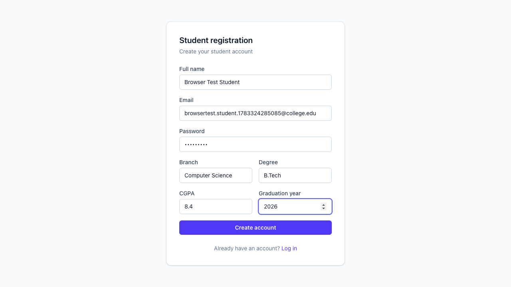
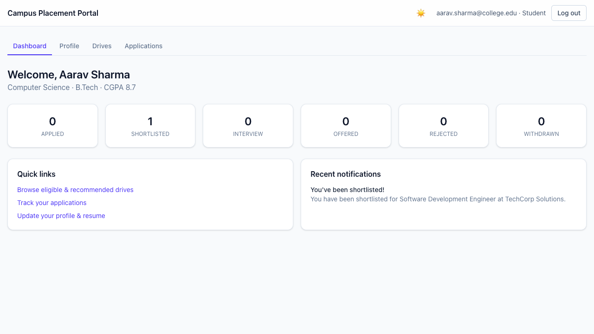
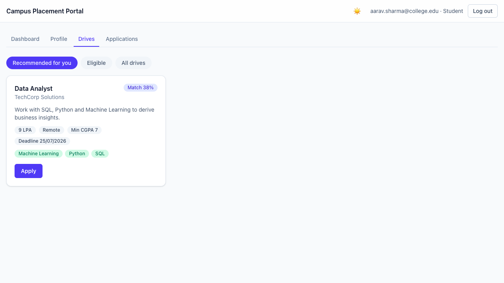
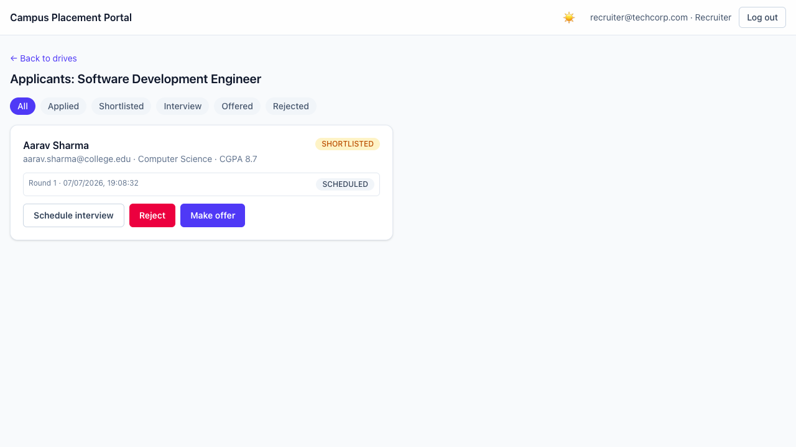
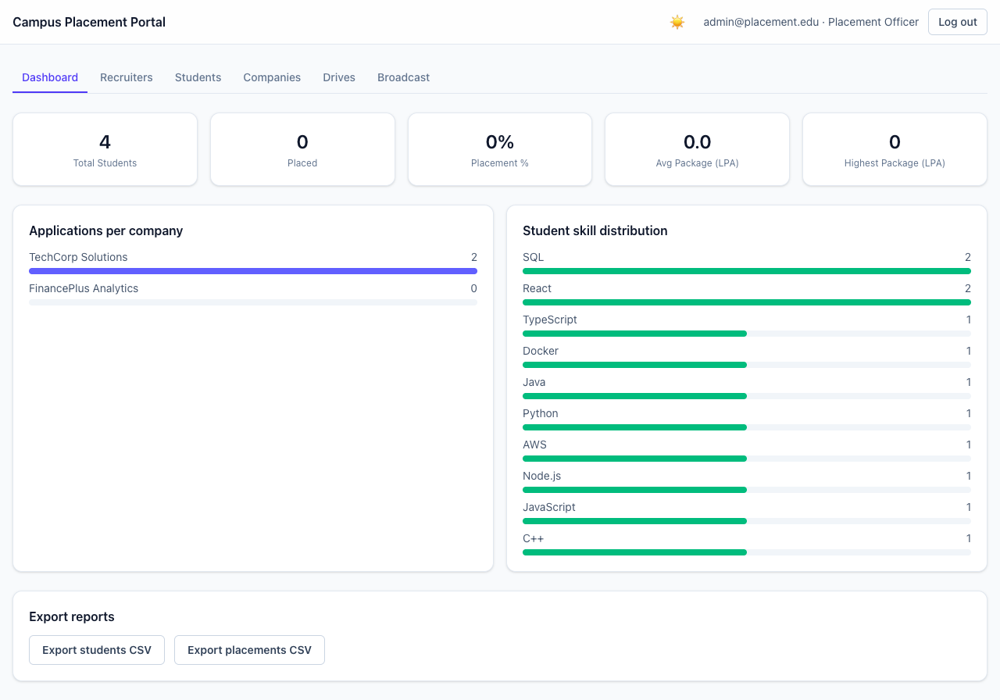
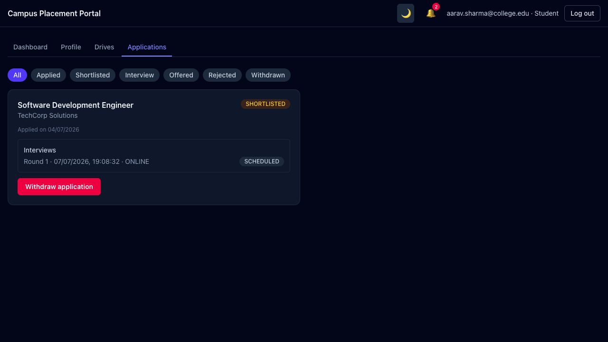
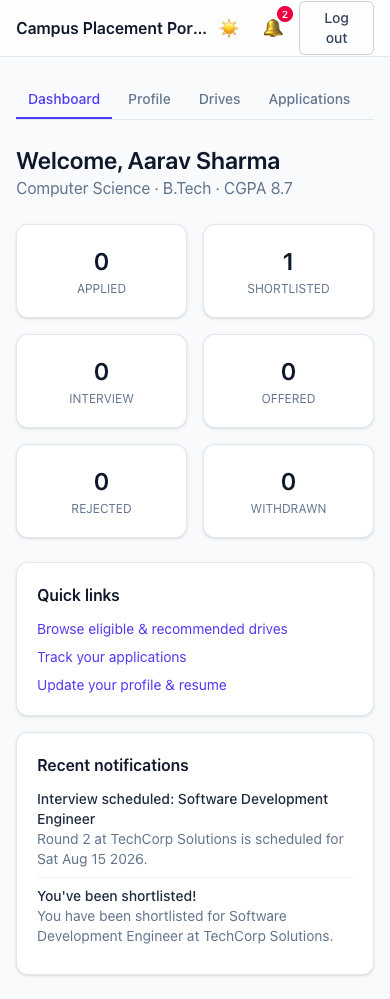

# Campus Placement Portal

A full-stack campus placement management system for colleges, with role-based workflows for Students, Recruiters, and Placement Officers.

## Overview

Covers the full placement lifecycle: student profiles, resume upload and parsing, company/drive management, an automated eligibility engine, applications through interviews and offers, notifications, analytics with CSV export, and a skill-based drive recommendation engine. Recruiter accounts require Placement Officer approval before they can log in.

## Tech Stack

- **Frontend**: React, TypeScript, Vite, React Router, Axios, Tailwind CSS, React Hook Form + Zod
- **Backend**: Node.js, Express, TypeScript (layered: controllers/services/repositories/validators)
- **Database**: PostgreSQL + Prisma ORM
- **Auth**: JWT (access + rotating refresh token), bcrypt, RBAC middleware
- **Caching**: Redis (cache-aside on list endpoints)
- **Docs**: Swagger / OpenAPI (`/api-docs`)
- **Testing**: Jest, Supertest (unit + integration, 100+ tests)
- **Infra**: Docker, Docker Compose

## Setup

```bash
git clone <repo-url>
cd soft_project
cp server/.env.example server/.env
cp client/.env.example client/.env
docker compose up --build
```

This starts Postgres, Redis, the API (migrations run automatically on boot), and the frontend. Then seed sample data:

```bash
docker compose exec server npx tsx prisma/seed.ts
```

Visit the app at `http://localhost:5173` and the API docs at `http://localhost:4000/api-docs`.

Seeded accounts (see `server/prisma/seed.ts`): `admin@placement.edu` / `Admin@123` (Placement Officer), `recruiter@techcorp.com` / `Recruiter@123` (approved Recruiter), `aarav.sharma@college.edu` / `Student@123` (Student).

## Run Commands (local dev, without Docker)

```bash
# Infra
docker compose up -d postgres redis

# Backend
cd server && npm install && npm run prisma:migrate && npm run dev

# Frontend
cd client && npm install && npm run dev

# Tests
cd server && npm test
```

## Screenshots

| | |
|---|---|
|  |  |
|  |  |
|  |  |
|  | |

## Future Improvements

- CI pipeline (GitHub Actions) running lint/typecheck/tests on every PR
- Calendar integration (.ics) for interview scheduling
- Audit logs for admin actions
- Resume score / ATS-style feedback for students
